# Smart Home Control

**Smart Home Control** is a full-stack web application that provides users with the ability to manage, monitor, and automate their smart home devices from a single platform. This project simplifies home automation, allowing users to control home devices remotely, securely, and efficiently.

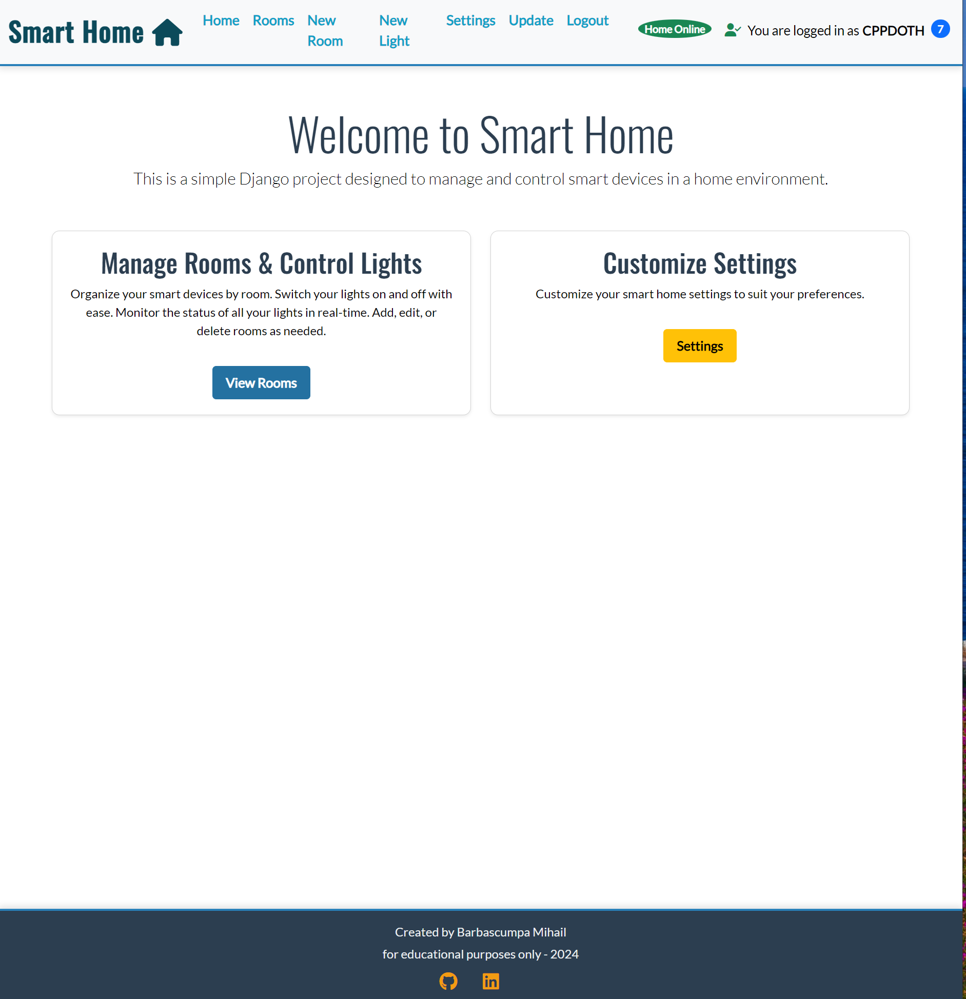

### [Link to Live Website](https://home-control-dbba5bec072c.herokuapp.com/)

---

# Table of Contents

1. [Smart Home Control](#smart-home-control)
2. [Link to Live Website](#link-to-live-website)
3. [Site & User Goals](#site--user-goals)
   - [Site Goals](#site-goals)
   - [User Goals](#user-goals)
4. [User Experience Design](#user-experience-design)
   - [Agile Planning](#agile-planning)
5. [The Strategy Plane](#the-strategy-plane)
   - [Site Goals](#site-goals-1)
6. [The Structure Plane](#the-structure-plane)
   - [Features](#features)
   - [Existing Features](#existing-features)
7. [The Skeleton Plane](#the-skeleton-plane)
   - [Wireframes](#wireframes)
   - [Database Design](#database-design)
8. [Tools and Technologies](#tools-and-technologies)
9. [Testing](#testing)
   - [Responsiveness](#responsiveness)
   - [Validator Testing](#validator-testing)
   - [Manual Testing](#manual-testing)
10. [Bugs](#bugs)
    - [Unfixed Bugs](#unfixed-bugs)
11. [Deployment](#deployment)
    - [Version Control](#version-control)
    - [Deployment in Heroku](#deployment-in-heroku)
    - [Cloning the Repository](#cloning-the-repository)
    - [Forking](#forking)
12. [Credits](#credits)
13. [Acknowledgements](#acknowledgements)
> **Note**: Please refer to the [Legal Disclaimer & Security Considerations](#legal-disclaimer--security-considerations) section at the end of this document before deploying the application to ensure safe and secure usage.


---

## Site & User Goals

This section outlines the primary goals for the **Smart Home Control** platform. The site is designed to help users remotely control, automate, and manage their smart home devices from anywhere.

### Site Goals

- **Device Management**: Provide a platform for users to add, configure, and manage smart home devices (at the moment lights. In the future is being considered thermostats, security systems, ventilation and so on ).
- **Automation**: Allow users to schedule device actions, such as turning lights on/off.
- **Multi-user Support**: Allow multiple users to manage the same home, with role-based permissions (e.g., admin, user).

### User Goals

- **Easy Control**: Users want an intuitive interface to control devices from their smartphones or desktops.
- **Security**: Users should feel confident that their home devices are secure and can only be accessed by authorized individuals.

- **Monitor & Alerts**: Users need real-time updates on the status of their devices.

---

## User Experience Design

### Agile Planning

The development process used the Agile methodology to prioritize and implement features through a series of user stories. The planning was managed via a GitHub project board using the MoSCoW method:

- **Must Have**: User authentication, device control, and automation.
- **Should Have**: Real-time monitoring, notification system.
- **Could Have**: Multi-user support, enhanced security features.

---

## The Strategy Plane

### Site Goals

- **Target Audience**: Homeowners and renters looking to automate and monitor their homes efficiently.
- **Business Goals**: Establish a secure, user-friendly platform for smart home management, encouraging user interaction and long-term retention.

---

## The Structure Plane

### Features

- **User Authentication:** Users can log in, log out, and manage their profiles.
- **Room Management:** Users can add, edit, and delete rooms.
- **Light Management:** Each room can have multiple lights, which users can toggle on or off via the web interface then send command to ESP32 device.
- **ESP32 Integration:** The project sends requests to the ESP32 device to control the lights.
- **User Settings:** Users can configure personal preferences such as email notifications, light scheduling, and device IP management.
- **Background Task:** A background thread checks the status of the home automation system periodically.

- **Device Management**: Users can add, configure, and control lights and rooms.

  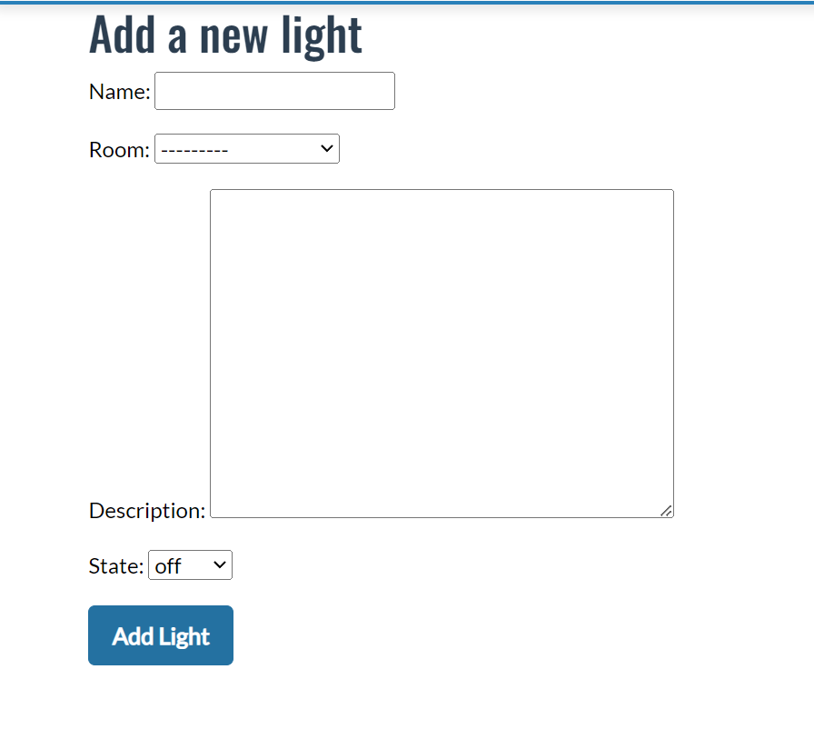

- **Room Management**: Users can add and manage rooms .

  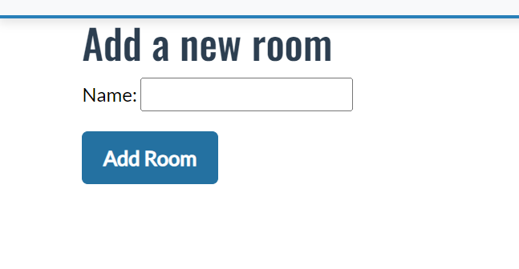

- **Automation**: Users can set up actions for their devices.
- **Real-time Monitoring**:Users can view live data from server(Not fully implemented) (e.g. get DEBUG will return current state of this var and so on).

  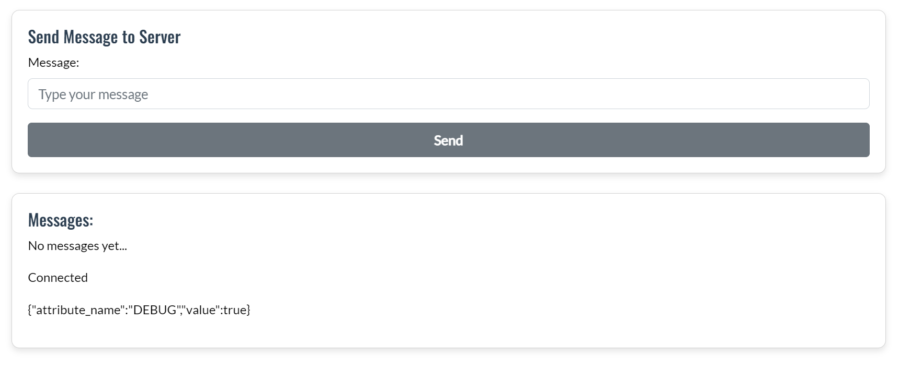

  - **Notifications**: Users receive audio and visual alerts when server is offline or is back online events .

  

### Existing Features

- **User Authentication**: Users can sign up, log in, and manage their accounts.

  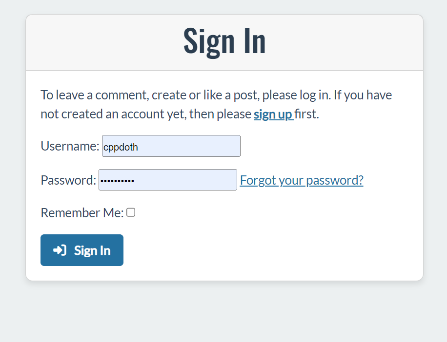
  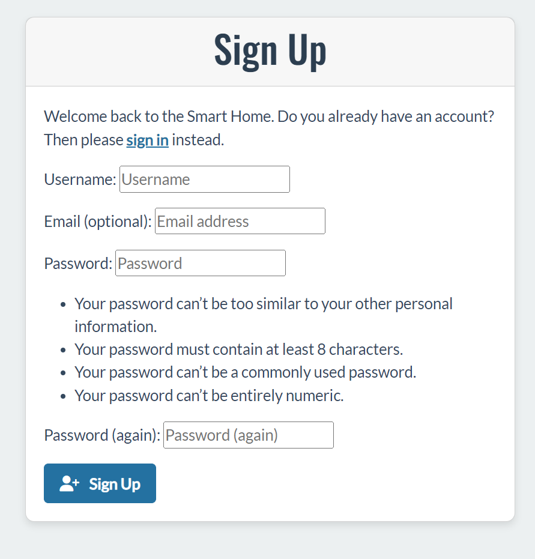

- **Device Dashboard**: A central dashboard for controlling all connected devices for logged in users.

  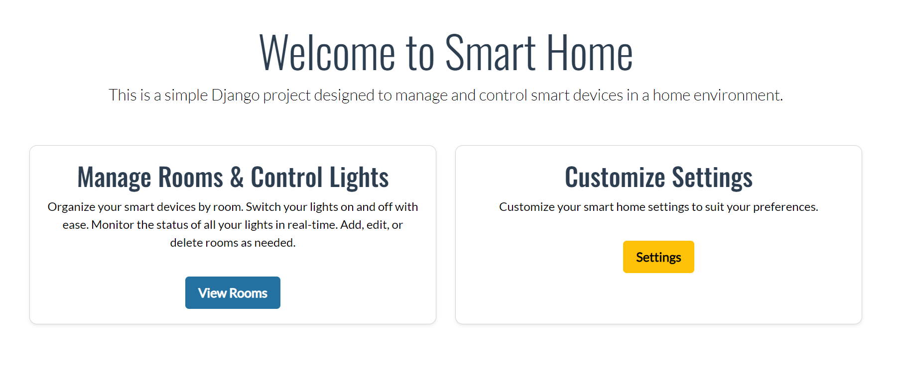

- **Role-based Permissions**: Admin users can manage access for other household members.

### Dynamic Icon Features

- **Dynamic Icons**: Show real-time status of devices.

  

- **Logged-in State Icon**: Displays when the user is logged in.

  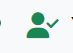

- **Logged-off State Icon**: Displays when the user is logged off.

  

- **Number of Rooms Icon**: Displays the number of rooms managed by the user.

  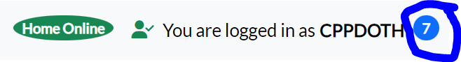

---

## The Skeleton Plane

## ERD (Entity Relationship Diagram)

Below is the **Entity Relationship Diagram (ERD)**, which visualizes the structure of the main entities (models) in the project and their relationships.

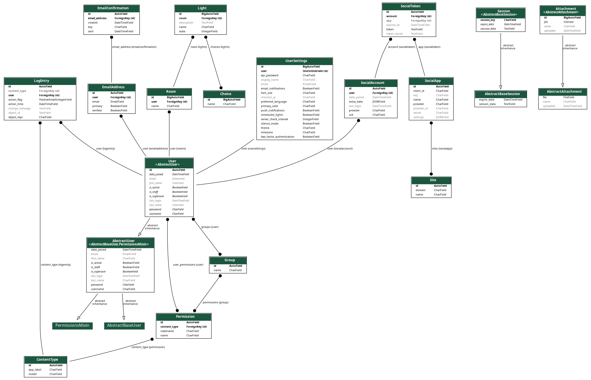

The ERD showcases the following relationships:

- **User:** This model represents the users in the system. Each user can have multiple rooms.
- **Room:** Each room is associated with a user and can contain multiple lights.
- **Light:** This model represents individual lights in a room. Lights have attributes like state (on/off) and name.
- **UserSettings:** This model stores individual user preferences like notifications, preferred language, IP address of the ESP32 device, and more.

### Wireframes

Wireframes were created to map out the layout and user interface of the platform. These include designs for:

- **Home Dashboard**: Displays device statuses and control when user is logged in:

  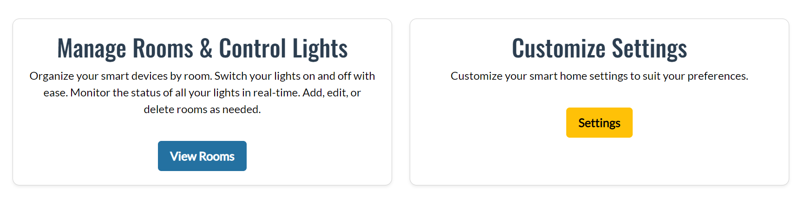

- and when user is logged out:
  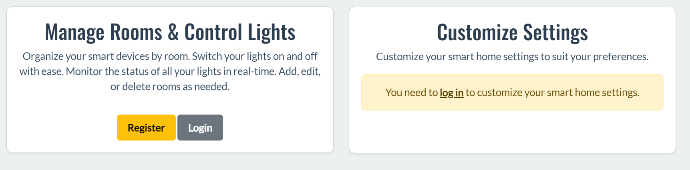

- **Device Management Page**: Allows users to interact with server through message(Not fully implemented).

  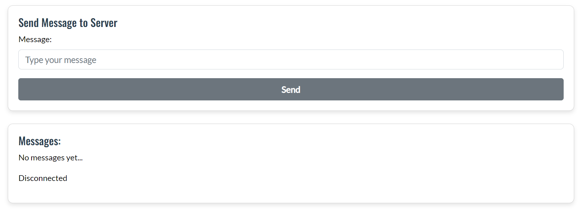

- **User Management Page**: Admin users can manage permissions for other users.

## Database Design

The database was structured using Django’s ORM to manage user accounts, smart devices (lights), rooms, and user-specific settings. Below are the key models and their relationships:

### Key Models:

1. **User** (Django’s built-in User model):

   - Represents the system users.
   - Each user can own multiple rooms, and each room can contain multiple smart devices (lights).

2. **Room**:

   - Represents a physical room in the user's home where smart devices are installed.
   - **Fields**:
     - `name`: The name of the room.
     - `user`: The user who owns this room (linked to the `User` model).
   - **Relationships**:
     - A `Room` has a **One-to-Many** relationship with the `User` model, meaning one user can have multiple rooms.

3. **Light**:

   - Represents individual smart devices (lights) that are controlled by the user.
   - **Fields**:
     - `name`: The name of the light.
     - `room`: The room where the light is located (linked to the `Room` model).
     - `state`: The current state of the light (`on`, `off`, `timer`).
     - `choices`: Multiple choices or configurations available for the light (linked to the `Choice` model).
   - **Relationships**:
     - A `Light` has a **Many-to-One** relationship with `Room`, meaning each room can have multiple lights.
     - A `Light` has a **Many-to-Many** relationship with the `Choice` model, meaning each light can have multiple configurations.

4. **Choice**:

   - Represents different options or configurations for the smart devices (lights).
   - **Fields**:
     - `name`: The name of the choice (e.g., "On","Off").
   - **Relationships**:
     - A `Choice` has a **Many-to-Many** relationship with the `Light` model, meaning a choice can be associated with multiple lights, and each light can have multiple choices.

5. **UserSettings**:
   - Represents user-specific settings, including preferences like notifications, theme, and smart device behavior.
   - **Fields**:
     - `user`: The user to whom these settings belong (linked to the `User` model).
     - `api_password`: A password for API authentication.
     - `server_check_interval`: How often the system checks the server (in seconds).
     - `email_notifications`, `push_notifications`, `two_factor_authentication`: Boolean fields indicating user preferences.
     - `m5core2_ip`: The IP address of the user's smart device (e.g., M5Core2).
   - **Relationships**:
     - A `UserSettings` model has a **One-to-One** relationship with the `User` model, meaning each user has their own settings.

### Relationships Summary:

1. **User to Room**: One-to-Many (1:M) relationship.

   - Each user can have multiple rooms.
   - Each room belongs to a specific user.

2. **Room to Light**: One-to-Many (1:M) relationship.

   - Each room can have multiple lights.
   - Each light belongs to a specific room.

3. **Light to Choice**: Many-to-Many (M:M) relationship.

   - Each light can have multiple configurations (choices).
   - Each choice can apply to multiple lights.

4. **User to UserSettings**: One-to-One (1:1) relationship.
   - Each user has unique settings related to notifications, themes, and smart device behavior.

---

## Tools and Technologies

1. **Django**:

   - Django is used as the backend framework for handling database operations, user authentication, and business logic.
   - The project makes extensive use of Django’s built-in apps, such as `django.contrib.auth` for user management and `django.contrib.admin` for the admin interface.
   - Middleware such as `SecurityMiddleware`, `SessionMiddleware`, and custom middleware like `UserSettingsMiddleware` are used to handle requests and manage user sessions securely.
   - Template rendering is done through Django's template engine, with templates stored in the `templates` directory.

2. **Bootstrap**:

   - Bootstrap was using for pages style .

3. **SQLite (Development) / PostgreSQL (Production)**:

   - **SQLite** is used as the default local database for development, configured through Django’s ORM.
   - In production, **PostgreSQL** is used to handle more complex queries and larger datasets. The database configuration is managed using `dj_database_url`, which pulls the database URL from environment variables.
   - Example:
     ```python
     DATABASES = {
         "default": dj_database_url.config(default=os.environ.get("DATABASE_URL"))
     }
     ```

4. **Heroku**:

   - The application is deployed on **Heroku**, which handles the hosting and scaling of the application.
   - Heroku’s environment is configured with Django’s settings, including support for static files via `WhiteNoise` and media file storage via Cloudinary.
   - Specific settings for static and media files are determined based on the environment (`DEBUG` mode):
     ```python
     if DEBUG:
         STATICFILES_STORAGE = "whitenoise.storage.CompressedStaticFilesStorage"
     else:
         STATICFILES_STORAGE = "whitenoise.storage.CompressedManifestStaticFilesStorage"
     ```

5. **Cloudinary**:

   - **Cloudinary** is used for storing and serving media files (such as user-uploaded images).
   - It allows the application to store media externally in a cloud service, freeing up local storage and ensuring quick access to images.
   - The connection to Cloudinary is configured via the `CLOUDINARY_URL` environment variable:
     ```python
     DEFAULT_FILE_STORAGE = "cloudinary_storage.storage.MediaCloudinaryStorage"
     ```
   - Additionally, `django-resized` is used for optimizing and resizing images before they are stored.

6. **Django Channels**:

   - **Django Channels** is used to enable real-time communication in the application, supporting WebSockets and asynchronous tasks. This is essential for handling live updates and interactions, particularly with smart home devices like lights and sensors( planing in feature).
   - The current implementation allows for basic real-time status updates of vars states.

   - **Planned Future Features**:

     - There are several advanced features planned for future implementation using Django Channels, including:
       - **Live Device Monitoring**: Users will be able to monitor the status of multiple smart devices in real-time, such as receiving updates from sensors or checking the live status of connected devices.
       - **Instant Notifications**: The system will be capable of sending real-time notifications and alerts when specific events occur, such as security breaches, motion detection, or temperature changes.
       - **Two-Way Communication**: The app will enable two-way communication with devices, allowing for real-time feedback and control. For example, lights can send back their status after a command is issued, ensuring synchronization between the user interface and device state.

   - **Current Setup**:

     - Django Channels is currently configured with an in-memory backend for handling real-time communication:
       ```python
       ASGI_APPLICATION = "home_control_project.asgi.application"
       CHANNEL_LAYERS = {
           "default": {
               "BACKEND": "channels.layers.InMemoryChannelLayer",
           },
       }
       ```
     - As the project scales and the need for more complex real-time features grows, there are plans to migrate to a more robust backend (e.g., Redis) to handle higher traffic volumes and more simultaneous connections.

     ```

     ```

7. **Django Extensions**:

   - The project uses `django-extensions` for various development utilities, such as enhanced model management, shell utilities, and custom scripts.

8. **Firmware Updates with Progress Feedback**

- This feature allows users to initiate remote firmware updates for the ESP32 device and monitor the progress in real-time through the web interface.

- **Upload Firmware**: The user can upload a firmware file through the Django web interface.
- **Remote Firmware Update**: Once uploaded, the firmware is transferred from the Django server to the ESP32 for the update process.
- **Real-time Progress Feedback**: Users can view live status updates of the firmware upload and installation process, ensuring transparency and tracking for the operation.
- **Error Handling**: In case of any issues during the upload or installation process, the user will receive appropriate error messages.

---

## Testing

### Responsiveness

The site was tested across multiple devices (desktop, tablet, smartphone) to ensure it is fully responsive. Tools such as Chrome DevTools were used to simulate various screen sizes.

### Validator Testing

- **HTML**: Validated with [W3C HTML Validator](https://validator.w3.org/).
- **CSS**: Passed through [W3C CSS Validator](https://jigsaw.w3.org/css-validator/).
- **JavaScript**: No major errors detected using JSHint.
- **Python**: Validated with PEP8 for code style.

### Manual Testing

- Users can successfully add, edit, and delete devices.
- Automations trigger correctly based on user input.
- Notifications are sent in real-time for monitored events.

---

## Bugs

### Fixed Bugs

- **Device Not Connecting**: Some devices did not connect to the platform. Fixed by adjusting the connection logic.
- **Automation Not Triggering**: Some automations were not triggering as expected. Resolved by updating the scheduling algorithm.

### Unfixed Bugs

- **Mobile Interface Glitches**: Some visual glitches occur on smaller screen sizes (e.g., dropdown menus). This will be addressed in a future update.

---

## Deployment

### Version Control

The project is managed using Git and GitHub for version control. The following steps were taken:

1. `git add .`
2. `git commit -m "commit message"`
3. `git push`

### Deployment in Heroku

The project was deployed on Heroku using the following steps:

1. Set up a Heroku app and connected it to the GitHub repository.
2. Configured environment variables (e.g., database URL, secret key).
3. Deployed using Heroku's automatic deploy feature.

### Cloning the Repository

To clone this repository:

1. Open your terminal.
2. Run the following command:
   ```bash
   git clone https://github.com/username/smart-home-control.git
   ```


---

## Legal Disclaimer & Security Considerations

### Disclaimer

This project, **Smart Home Control**, is intended solely for **educational purposes**. The author of this project assumes **no liability or responsibility** for any damage, harm, or unintended consequences that may arise from the use, modification, or deployment of this software. Users who choose to implement this software or integrate it into their systems do so **at their own risk**.

- This project is provided "as-is" without any warranties, guarantees, or assurances regarding its safety, reliability, or fitness for a particular purpose.
- Any damage caused by improper use, setup, or integration into third-party devices or networks is **solely the responsibility** of the user.
- **Port forwarding** or other networking configurations may expose your devices to external threats. It is your responsibility to ensure that your home network and devices are secure.

### Additional Security Considerations

1. **Port Forwarding**: If you plan to access your home automation system remotely, you may consider using port forwarding to allow external access to your server or devices. However, doing so can introduce serious security risks, such as unauthorized access to your home network.
   - **Use VPN**: For enhanced security, consider setting up a Virtual Private Network (VPN) to remotely access your home network securely rather than exposing your devices through port forwarding.
   - **Firewall Configuration**: Ensure your firewall is properly configured to block any unwanted traffic and to allow only necessary connections to your devices.

2. **Strong Passwords**: Ensure that all passwords, including those for the Django admin interface, your Wi-Fi network, and any API or device credentials, are strong and secure. Use a combination of uppercase and lowercase letters, numbers, and symbols.

3. **SSL/TLS Encryption**: It is strongly recommended that you use SSL/TLS encryption for all communication between the server (Django) and the devices (ESP32), especially if you plan to expose the system to the internet. This can help protect against Man-in-the-Middle (MitM) attacks.
   - Set up SSL certificates for your server.
   - Use `https` for web traffic and secure protocols for any device communications.

4. **Regular Updates**: Ensure that you keep the server, devices (ESP32), and libraries up-to-date with the latest security patches and firmware updates.
   - Check regularly for updates to the project’s dependencies and apply them where necessary.

5. **Access Control**: Only allow authorized users to manage or access your home devices. Consider implementing **role-based access control** (RBAC) and **two-factor authentication** (2FA) for critical systems.

6. **Cloud Services Security**: If you are using cloud services like **Heroku** or **Cloudinary**:
   - Ensure that your API keys and credentials are not exposed in the source code.
   - Use environment variables to store sensitive information, such as `SECRET_KEY`, database credentials, and any third-party API tokens.

7. **Public Deployment**: If you deploy this project on a public platform (e.g., Heroku), be cautious about exposing it to the internet. Misconfiguration could lead to unauthorized access. Always follow best practices for securing a web application, including **securing the admin interface**, **disabling unnecessary features in production**, and **monitoring logs for suspicious activity**.

---

## Security Best Practices for Smart Home Devices

When integrating IoT devices such as the ESP32, follow these additional guidelines to secure your smart home system:

1. **Device Isolation**: Consider setting up a separate network or VLAN for IoT devices. This ensures that even if a device is compromised, the attacker won't have access to the rest of your network.
   
2. **Update Firmware Regularly**: IoT devices often have vulnerabilities that are patched through firmware updates. Regularly update the firmware of the ESP32 and any other connected devices to mitigate known security risks.

3. **Secure Communication**: Use **HTTPS** and **WebSocket Secure (WSS)** protocols for secure communication between the Django server and ESP32 devices. This will ensure that data is transmitted securely over the network, preventing unauthorized interception.

4. **Disable Unused Services**: Disable any services or ports on the ESP32 that are not in use. Reducing the number of open ports decreases the attack surface.

5. **Logging and Monitoring**: Implement logging and monitoring tools on your Django server to track access attempts and potential security breaches. Configure notifications for suspicious activity or failed login attempts.

### Further Reading

For more detailed information on securing IoT and web applications, consider reviewing the following resources:

- [OWASP IoT Security Guidelines](https://owasp.org/www-project-internet-of-things/)
- [OWASP Top 10 Web Application Security Risks](https://owasp.org/www-project-top-ten/)
- [NIST Cybersecurity Framework](https://www.nist.gov/cyberframework)

---

By following these security guidelines and taking appropriate precautions, you can help mitigate risks and protect your home automation system from unauthorized access or exploitation.

